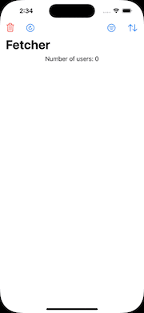

## Fetcher: A SwiftUI App for User Management

This repository is a project I built to explore storing API responses using SwiftData. It's a simple SwiftUI application that allows one to manage a list of users. Users can be filtered by active status, sorted by name or activity, and deleted individually or all at once. The application also includes functionality to refresh the user data.

While building this app, I learned a lot about SwiftData and its capabilities for managing persistent data in SwiftUI applications.

### Features

* Filter users by active status (All, Active, Offline)
* Sort users by name or activity (ascending/descending)
* View detailed information for each user
* Delete individual users
* Delete all users with confirmation

### Requirements

* Xcode 14+
* Swift 6+

### Dependencies

* SwiftData: [https://developer.apple.com/documentation/swiftdata](https://developer.apple.com/documentation/swiftdata) (for core data management)

### Usage

1. Clone the repository.
2. Open the project in Xcode.
3. Run the application on a simulator or device.

### Contributing

I encourage pull requests to improve the application. Please ensure your code adheres to the existing code style and includes relevant tests.

### License

This project is licensed under the MIT License. See the LICENSE file for details.

